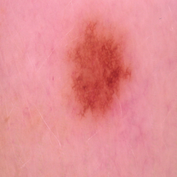
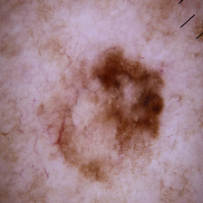

# Skin Cancer Detection with Deep Learning
Skin cancer detection project for Unstructured Data Analysis subject from the Master in Big Data at Universidad Pontificia Comillas. The goal of this project is to develop a Deep Learning model that can classify images of skin lesions into benign or malignant. The dataset used is from [Kaggle](https://www.kaggle.com/datasets/fanconic/skin-cancer-malignant-vs-benign) and contains 1800 images of skin lesions.

## ⚕️ Dataset
The dataset used for this project is from [Kaggle](https://www.kaggle.com/datasets/fanconic/skin-cancer-malignant-vs-benign) and contains 3297 images of benign skin moles and malignant skin moles. The images are in JPG format and have a resolution of 224x224 pixels. The dataset is divided into two folders, one for each class and into training and testing sets (80% and 20% respectively).

A sample of the images is shown below:

  

    
    
Benign

  

  

    
    
Malignant

  

## 🧠 Deep Learning Techniques
Several Deep Learning techniques have been used to classify the images, from more traditional models like Dense Neural Networks to more complex models like Transfer Learning with Convolutional Neural Networks.
- [ ] Dense Neural Network
- [X] Convolutional Neural Network from scratch
- [ ] Convolutional Neural Network with Data Augmentation
- [X] Transfer Learning with ResNet152
- [X] Transfer Learning with VGG19

## 🛠️ Technologies
- Python
- TensorFlow
- Keras
- Scikit-learn
- Matplotlib
- Jupyter Notebook
- Streamlit
- Pandas

## 🚀 Deployment
An interactive web application has been developed using Streamlit to classify images of skin lesions. The application allows the user to upload an image and get the prediction of the model. The application is hosted on Streamlit Sharing and can be accessed [here]().

## 👩🏻‍💻 Authors
- [Blanca Martínez Rubio](https://github.com/blancamartnez)
- [María Belén Salgado Bottaro](https://github.com/MARIABELENSB)
- [Elena Cabrera Casquet](https://github.com/elena-cabrera)
